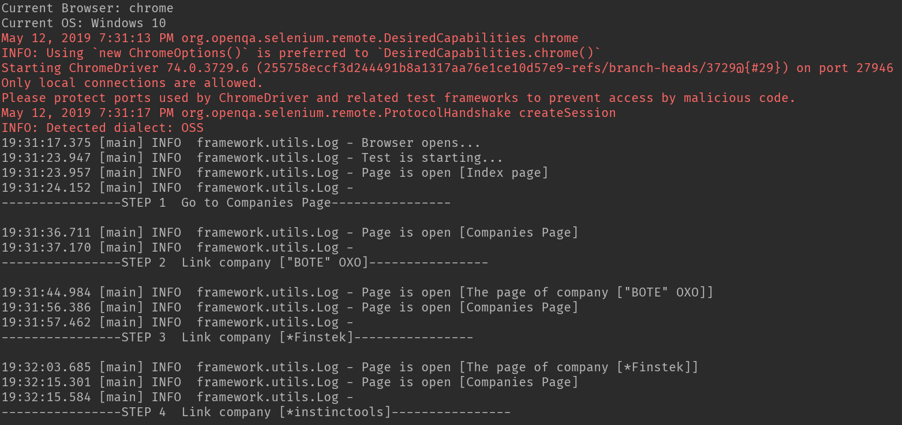

"# IDT-Test-Task" 

Need to fix ajax request 
(POST https://companies.dev.by/recaptcha) 
waitAjax or explicitWait doesn't help, 
CapabilityGenerator and firefoxdriver too

## GENERAL REQUIREMENTS (STEPS)
1) Open Dev.by
2) Go to "Компании" page
3) Open 1st company in a list
4) Verify that company has an email/phone/website address
5) Repeat for other 10 companies

## Result
